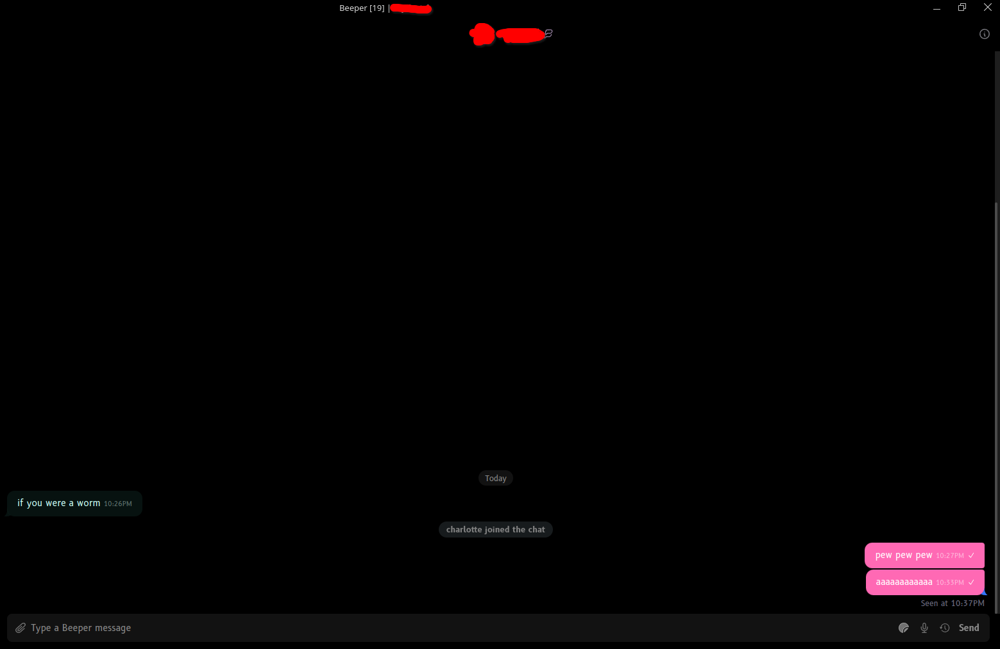
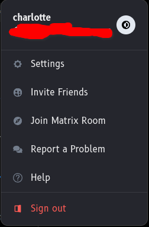

# Beeper Midnight Pink Decluttered

## Description
Simple, pitch-black css theme for Beeper desktop client with pink messages and decluttered settings.

Note: The tail of messages is still blue as this is shared between incoming and outgoing messages.

## Preview

## How to Use
It is very simple to apply CSS themes to the Beeper desktop client.

1. Open Beeper Desktop
2. Click the gear icon
3. Choose "Settings"
4. Choose "Appearance"
5. Copy the contents of `beeper-midnight-pink.css` from this repo into the custom CSS input at the bottom
6. Click "Apply"

Congratulations, you now are using Beeper Midnight Pink. It is important to note that this requires you to update it yourself should the need arise by repeating this process with any updates made to this repository.
